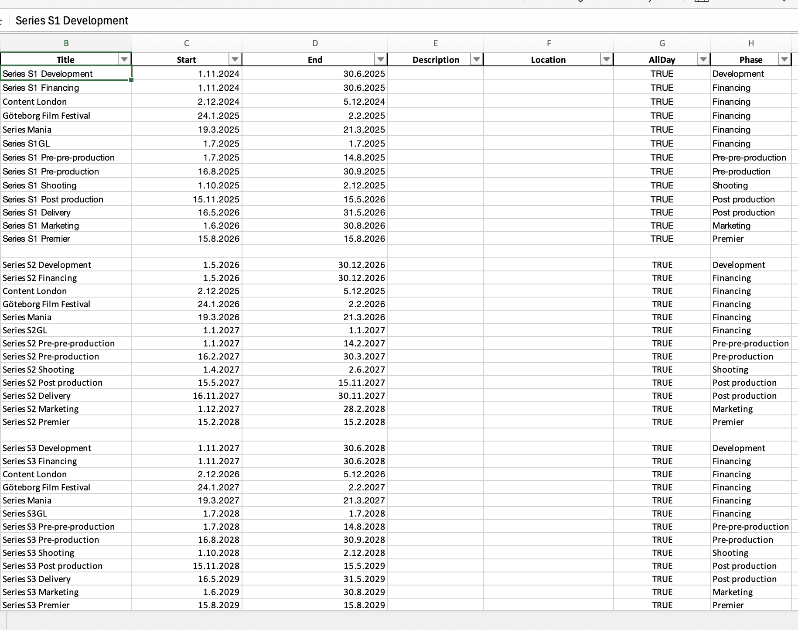
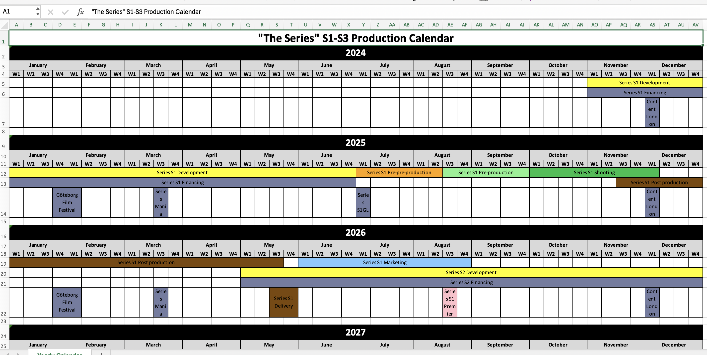
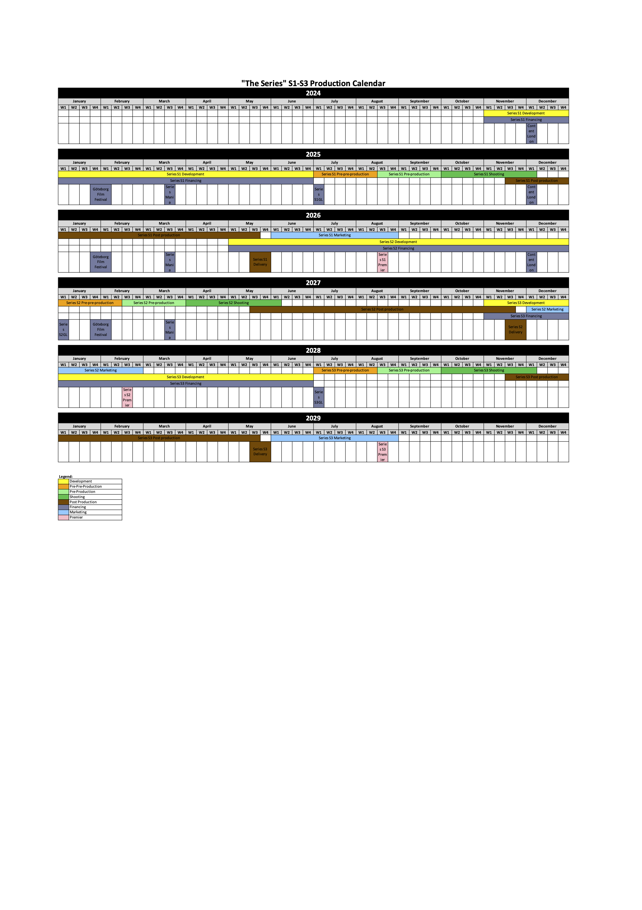

# Yearly Prodocution Calendar Export

*Note: This code and the README.md file were created with ChatGPT (version o1-preview). I don’t have prior coding knowledge, and the same bot guided me through navigating GitHub. However, the code appears to work for my purposes.*

This Python script reads calendar data from an Excel file and creates a yearly production calendar in a new Excel file. The resulting file displays events organized by year, month, and week, with customizable formatting options, including colors and column widths.


## Table of Contents

- [Example Images](#example)
- [Requirements](#requirements)
- [Project Structure](#project-structure)
- [Configuration](#configuration)
- [Usage](#usage)
- [File Descriptions](#file-descriptions)
- [Customization](#customization)
- [Licence](#licence)
- [Contact](#contact)

## Example Images





## Requirements

This project requires the following packages:
- `pandas`
- `openpyxl`

You can install them with:
```bash
pip install pandas openpyxl
```

## Project Structure

- `Calendar_table.xlsx` - The input Excel file containing calendar events.
- `settings.txt` - Configuration file for title, colors, column widths, and row heights.
- `yearly_calendar.xlsx` - Output file generated by the script.

## Configuration

### Input File

Ensure `Calendar_table.xlsx` contains the following columns:
- `Start` - Start date of the event.
- `End` - End date of the event.
- `Phase` - Event phase (color-coded in `settings.txt`).

### Settings File

The `settings.txt` file defines parameters for calendar formatting, including:
- `TITLE` - Title of the output calendar.
- `COLUMN_WIDTH` - Width of calendar columns.
- `PHASE_COLORS` - Color codes for event phases.
- `ROW_HEIGHTS` - Row heights for different event types.

## Usage

Run the script with:

```bash
python <script_name>.py
```

This will create a new file `yearly_calendar.xlsx` with events organized by year, month, and week.

## File Descriptions

- **Main Script** - Reads data, applies formatting, and generates a yearly calendar.
- **Settings File** - Allows customization of colors, column widths, and event phases.
- **Output File** - Yearly calendar in Excel format with organized and color-coded events.

## Customization

Adjust `settings.txt` to define:
- **Title** for the calendar.
- **Column Width** for better readability.
- **Phase Colors** to visually distinguish event types.
- **Row Heights** for long and short events.

## LICENCE
License
This project is licensed under the MIT License (https://choosealicense.com/licenses/mit/)

## Contact

For any questions or feedback, please contact Joonas Kauppinen (joonaskauppinen@hotmail.com)

